<h1 align="center">English Language Notes</h1>

- [Vocabulary and Pronunciation:](#vocabulary-and-pronunciation)
  - [Alphabet:](#alphabet)
  - [Name of 7 Days:](#name-of-7-days)
  - [Name of 12 Months:](#name-of-12-months)
  - [Numbers:](#numbers)
  - [Animals:](#animals)
  - [Birds:](#birds)
  - [Fish:](#fish)
  - [Insects:](#insects)
  - [Fruits:](#fruits)
  - [Vegetables:](#vegetables)
  - [Foods:](#foods)
  - [Human Body:](#human-body)

# Vocabulary and Pronunciation:

Note: For better pronunciation follow this websites: 
- https://elsaspeak.com/en/learn-english/how-to-pronounce
- https://www.oxfordlearnersdictionaries.com/definition/english

## Alphabet:

| Col 1      | Col 2      | Col 3   | Col 4   | Col 5   | Col 6       | Col 7  |
| ---------- | ---------- | ------- | ------- | ------- | ----------- | ------ |
| A = এই     | **B = বী👄** | C = সী   | D = ডী   | E = ঈ   | **F = এফ😁** | G = জী  |
| H = এইচ্    | I = আই     | J = জেই  | K = খেই  | L = এল  | M = এম      | N = এন |
| O = ওউ     | **P = ফী👄** | Q = খীউ  | R = আর  | S = এস  | T = ঠী       | U = ইউ |
| **V = ভী😁** | W = ডাবলইউ  | X = এক্স | Y = ওয়াই | Z =জেড/জি |             |        |

Note: 
- B, P (👄): দুই ঠোঁট মিশিয়ে পড়তে হবে।
- F, V (😁): উপরের দাঁত নিচের ঠোঁটের সাথে মিশিয়ে পড়তে হবে।

## Name of 7 Days:
- Saturday = স্যাডারডেই
- Sunday = সানডেই 
- Monday = মানডেই
- Tuesday = ঠিউজডেই
- Wednesday = ওয়েন্সডেই
- Thursday = থ্রাজডেই
- Friday = ফ্রাইডেই

For Practice:
- Day = ডেই, Pay = ফেই, Lay = লেই, May = মেই, Say = ছেই, Bay = বেই
- Holiday = হলিডেই, Today = ঠুডেই, Yesterday = ইয়েস্টারডেই, Display = ডিসপ্লেই, Okay = ঔখেই  

## Name of 12 Months:
- January = জ্যান-ইউ-এরি 
- February = ফেব-রু-এরি
- March = মার্চ
- April = এইপ্রল
- May = মেই
- June = জুন
- July = জুলায়
- August = ওগাস্ট
- September = সেপঠেম্বার
- October = অকঠৌবার
- November = নৌভেম্বার
- December = ডিসেম্বার

## Numbers:

|     |              |           |
| --- | ------------ | --------- |
| 01  | One          | ওয়ান       |
| 02  | Two          | ঠু         |
| 03  | Three        | থ্রি        |
| 04  | Four         | ফৌর        |
| 05  | Five         | ফাইভ       |
| 06  | Six          | সিক্স       |
| 07  | Seven        | সেভেন       |
| 08  | Eight        | এইঠ       |
| 09  | Nine         | নাইন       |
| 10  | Ten          | ঠেন        |
| 11  | Eleven       | লাভেন       |
| 12  | Twelve       | ঠুয়ালভ      |
| 13  | Thirteen     | থারঠীন      |
| 14  | Fourteen     | ফৌরঠীন      |
| 15  | Fifteen      | ফিফঠীন      |
| 16  | Sixteen      | সিক্সঠীন     |
| 17  | Seventeen    | সেভেনঠীন     |
| 18  | Eighteen     | এইঠীন      |
| 19  | Nineteen     | নাইনঠীন     |
| 20  | Twenty       | ঠুয়েনঠি/ঠুয়েনি  |
| 21  | Twenty One   | ঠুয়েনঠি ওয়ান  |
| 22  | Twenty Two   | ঠুয়েনঠি ঠু    |
| 23  | Twenty Three | ঠুয়েনঠি থ্রি   |
| 24  | Twenty Four  | ঠুয়েনঠি ফোর   |
| 25  | Twenty Five  | ঠুয়েনঠি ফাইভ  |
| 26  | Twenty Six   | ঠুয়েনঠি সিক্স  |
| 27  | Twenty Seven | ঠুয়েনঠি সেভেন  |
| 28  | Twenty Eight | ঠুয়েনঠি এইঠ  |
| 29  | Twenty Nine  | ঠুয়েনঠি নাইন  |
| 30  | Thirty       | থারঠি       |
| 40  | Forty        | ফৌরঠি       |
| 50  | Fifty        | ফিফঠি       |
| 60  | Sixty        | সিক্সঠি      |
| 70  | Seventy      | সেভেনঠি      |
| 80  | Eighty       | এইঠি       |
| 90  | Ninety       | নাইনঠি      |
| 100 | One Hundred  | ওয়ান হানড্রেড |

|                   |       |                 |
| ----------------- | ----- | --------------- |
| First             | 1st   | ফারর্স্ট           |
| Second            | 2nd   | সেখেন্ড            |
| Third             | 3rd   | থারড             |
| Fourth            | 4th   | ফৌরথ             |
| Fifth             | 5th   | ফিফথ             |
| Sixth             | 6th   | সিক্সথ            |
| Seventh           | 7th   | সেভেন্থ            |
| Eighth            | 8th   | এইঠথ            |
| Ninth             | 9th   | নাইন্থ            |
| Tenth             | 10th  | টেন্থ             |
| Eleventh          | 11th  | লাভেন্থ            |
| Twelfth           | 12th  | ঠুয়ালভথ           |
| Thirteenth        | 13th  | থারর্ঠীন্থ          |
| Fourteenth        | 14th  | ফৌরঠীন্থ           |
| Fifteenth         | 15th  | ফিফঠীন্থ           |
| Sixteenth         | 16th  | সিক্সঠীন্থ          |
| Seventeenth       | 17th  | সেভেনঠীন্থ          |
| Eighteenth        | 18th  | এইঠীন্থ           |
| Nineteenth        | 19th  | নাইনঠীন্থ          |
| Twentieth         | 20th  | ঠুয়েনঠিথ           |
| Thirtieth         | 30th  | থারঠিথ            |
| Fortieth          | 40th  | ফৌরঠিথ            |
| Fiftieth          | 50th  | ফিফঠিথ            |
| Sixtieth          | 60th  | সিক্সঠিথ           |
| Seventieth        | 70th  | সেভেনঠিথ           |
| Eightieth         | 80th  | এইঠিথ            |
| Ninetieth         | 90th  | নাইনঠিথ           |
| hundredth         | 100th | হানড্রেথ           |
| one hundred first | 101st | ওয়ান হানড্রেড ফারর্স্ট |

## Animals:

| Name             | Pronunciation | Image                                             |
| ---------------- | ------------- | ------------------------------------------------- |
| Dog              | ডগ            |                                                   |
| Cat              | খ্যাঠ           |                                                   |
| Cow              | খাউ            | 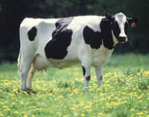           |
| Ox (ষাঁড়)          | অক্স           | 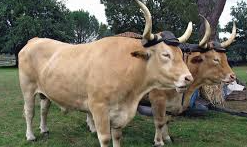             |
| Buffalo (মহিষ)    | বাফোলো           | 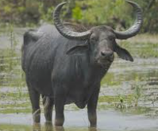   |
| Goat             | গোউঠ           |                                                   |
| Sheep            | শিপ            |                                                   |
| Horse            | হোরস           |                                                   |
| Pig              | ফিগ            |                                                   |
| Rabbit           | র‍্যাবিঠ          |                                                   |
| Mouse            | মাউস           |                                                   |
| Rat              | র‍্যাঠ           |                                                   |
| Deer             | ডিয়ার           |                                                   |
| Wolf (নেকড়ে)       | উ-ওলফ         | 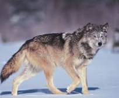         |
| Fox (শিয়াল)        | ফাকস           | 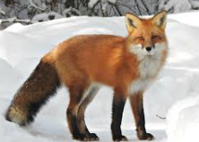           |
| Bear             | বেয়ার           |                                                   |
| Lion             | লায়ান           | 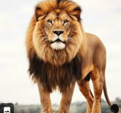         |
| Tiger            | ঠাইগার          | 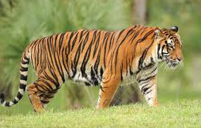       |
| Leopard          | ল্যাপারড         | 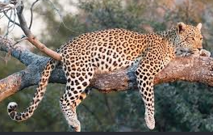   |
| Cheetah          | চিeee-ডা        | 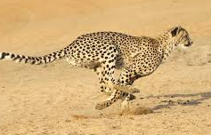   |
| Hyena            | হাই-ই-না        |        |
| Elephant         | এলআফেন্ট        |                                                   |
| Monkey           | মাংখি            |                                                   |
| Gorilla          | গরিলা           |                                                   |
| Zebra            | জিইব্রা          |                                                   |
| Giraffe          | জিইরাফ          |                                                   |
| Kangaroo         | খ্যাংগারু          |                                                   |
| Panda            | ফ্যানডা          |                                                   |
| Camel            | খ্যামেল          |                                                   |
| Donkey           | ডংখি            |                                                   |
| Squirrel (কাঠবিড়ালি) | skwur-əl      |                                                   |
| Bat              | ব্যাঠ           |                                                   |
| Hedgehog         | হেজ-হগ         | 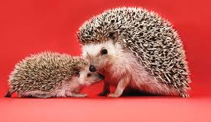 |
| Otter            | অঠার           |        |
| Seal             | সিল            | 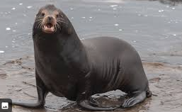         |
| Whale (তিমি)       | ওয়েল           |                                                   |
| Dolphin          | ডলফিন          |                                                   |
| Shark            | শার্ক           |                                                   |
| Crocodile        | ক্রখোডাইল        |                                                   |
| Snake            | স্নেইক          |                                                   |
| Lizard (টিকটিকি)    | লি-zerd        |                                                   |
| Turtle           | ঠার-ডাল         |                                                   |
| Frog             | ফ্রগ           |                                                   |

## Birds: 
| Bird       | American Accent | British Accent |
| ---------- | --------------- | -------------- |
| Chicken    | chik-ən         | chik-in        |
| Duck       | duk             | dʌk            |
| Goose      | goos            | goos           |
| Turkey     | tur-kee         | tuh-kee        |
| Eagle      | ee-gəl          | ee-gl          |
| Owl        | owl             | owl            |
| Crow       | kroh            | کرو (kroh)     |
| Pigeon     | pij-ən          | pij-in         |
| Sparrow    | sper-oh         | spar-oh        |
| Parrot     | pair-ət         | pa-rət         |
| Peacock    | pee-kok         | pee-kok        |
| Swan       | swan            | swon           |
| Flamingo   | fluh-ming-go    | फ्लuh-ming-go   |
| Penguin    | peng-gwin       | peng-gwin      |
| Seagull    | see-gul         | see-gul        |
| Woodpecker | wood-pek-er     | wood-pek-uh    |
| Kingfisher | king-fish-er    | king-fish-uh   |
| Robin      | rob-in          | rob-in         |
| Hawk       | hawk            | hawk           |
| Falcon     | fal-kən         | fal-kən        |
| Vulture    | vul-cher        | vul-chuh       |
| Crane      | krayn           | krayn          |
| Stork      | stork           | stawk          |
| Heron      | her-ən          | her-on         |
| Dove       | duhv            | duhv           |
| Canary     | kuh-nair-ee     | kuh-na-ree     |
| Crow       | kroh            | kroh           |
| Magpie     | mag-pie         | mag-pie        |
| Ostrich    | os-trich        | os-trich       |
| Emu        | ee-myoo         | ee-myoo        |

## Fish: 
| Fish                     | American Accent | British Accent |
| ------------------------ | --------------- | -------------- |
| Salmon                   | sam-ən          | sam-ən         |
| Tuna                     | too-nə          | tyoo-nə        |
| Carp                     | karp            | kaap           |
| Catfish                  | kat-fish        | kat-fish       |
| Goldfish                 | gohld-fish      | gohld-fish     |
| Shark                    | shark           | shaak          |
| Eel                      | eel             | eel            |
| Trout                    | trout           | trout          |
| Cod                      | kod             | kod            |
| Sardine                  | sar-deen        | sar-deen       |
| Anchovy                  | an-cho-vee      | an-cho-vee     |
| Mackerel                 | mak-ər-əl       | mak-rəl        |
| Herring                  | her-ing         | her-ing        |
| Snapper                  | snap-er         | snap-uh        |
| Grouper                  | groo-per        | groo-puh       |
| Tilapia                  | tuh-lah-pee-uh  | tih-lah-pee-uh |
| Bass                     | bas             | bahs           |
| Flounder                 | floun-der       | floun-duh      |
| Halibut                  | hal-uh-bət      | hal-uh-bət     |
| Swordfish                | sord-fish       | sawd-fish      |
| Pufferfish               | puh-fer-fish    | puh-fuh-fish   |
| Clownfish                | klown-fish      | klown-fish     |
| Angelfish                | ayn-jel-fish    | ayn-jel-fish   |
| Betta                    | bet-uh          | bet-uh         |
| Guppy                    | gup-ee          | gup-ee         |
| Koi                      | koy             | koy            |
| Barracuda                | bar-uh-koo-duh  | bar-uh-koo-duh |
| Stingray                 | sting-ray       | sting-ray      |
| Bluefish                 | bloo-fish       | bloo-fish      |
| Whitefish                | white-fish      | white-fish     |
| Hilsa (Ilish)            | il-ish          | il-ish         |
| Rohu (Rui)               | roo             | roo            |
| Catla                    | kat-lah         | kat-lah        |
| Mrigal                   | mrig-al         | mrig-al        |
| Pangas                   | pan-gas         | pan-gas        |
| Koi (Climbing perch)     | koy             | koy            |
| Shing (Stinging catfish) | shing           | shing          |
| Magur (Walking catfish)  | ma-gur          | ma-guh         |
| Pabda                    | pab-da          | pab-da         |
| Chital                   | chit-al         | chit-al        |
| Tengra                   | ten-gra         | ten-gra        |
| Boal                     | bo-al           | bo-al          |
| Chanda                   | chan-da         | chan-da        |

## Insects: 

| Insect      | American Accent | British Accent |
| ----------- | --------------- | -------------- |
| Ant         | ant             | ant            |
| Bee         | bee             | bee            |
| Butterfly   | but-er-fly      | but-uh-fly     |
| Mosquito    | muh-skee-toh    | muh-skee-toh   |
| Fly         | fly             | fly            |
| Housefly    | hous-fly        | hous-fly       |
| Cockroach   | kok-rohch       | kok-rohch      |
| Beetle      | bee-tl          | bee-tl         |
| Ladybug     | lay-dee-bug     | lay-dee-bug    |
| Dragonfly   | drag-ən-fly     | drag-ən-fly    |
| Grasshopper | gras-hop-er     | gras-hop-uh    |
| Cricket     | krik-it         | krik-it        |
| Wasp        | wosp            | wosp           |
| Hornet      | hor-net         | hor-net        |
| Termite     | tur-mite        | tuh-mite       |
| Moth        | moth            | moth           |
| Caterpillar | kat-er-pil-er   | kat-uh-pil-uh  |
| Flea        | flee            | flee           |
| Louse       | lous            | lous           |
| Tick        | tik             | tik            |
| Firefly     | fye-er-fly      | fye-uh-fly     |
| Cicada      | si-kay-duh      | si-kay-duh     |
| Locust      | loh-kust        | loh-kust       |
| Stink bug   | stink-bug       | stink-bug      |
| Aphid       | ay-fid          | ay-fid         |

## Fruits:
| Fruit        | American Accent | British Accent |
| ------------ | --------------- | -------------- |
| Apple        | ap-əl           | ap-əl          |
| Banana       | buh-na-nuh      | buh-na-nuh     |
| Orange       | or-inj          | or-inj         |
| Mango        | man-go          | man-go         |
| Grapes       | grayps          | grayps         |
| Pineapple    | pine-ap-əl      | pine-ap-əl     |
| Papaya       | puh-pie-uh      | puh-pie-uh     |
| Watermelon   | waw-ter-mel-ən  | wo-tuh-mel-ən  |
| Guava        | gwa-vuh         | gwa-vuh        |
| Jackfruit    | jak-fruit       | jak-fruit      |
| Coconut      | koh-kuh-nut     | koh-kuh-nut    |
| Lemon        | lem-ən          | lem-ən         |
| Lime         | lime            | lime           |
| Strawberry   | straw-ber-ee    | straw-bruh-ee  |
| Blueberry    | bloo-ber-ee     | bloo-ber-ee    |
| Cherry       | cher-ee         | cher-ee        |
| Peach        | peech           | peech          |
| Pear         | pair            | peh-uh         |
| Plum         | pluhm           | pluhm          |
| Pomegranate  | pom-uh-gran-it  | pom-uh-gran-it |
| Lychee       | lee-chee        | lee-chee       |
| Dragon fruit | drag-ən fruit   | drag-ən fruit  |
| Kiwi         | kee-wee         | kee-wee        |
| Fig          | fig             | fig            |
| Avocado      | av-uh-kah-doh   | av-uh-kah-doh  |

## Vegetables: 
| Vegetable          | American Accent | British Accent |
| ------------------ | --------------- | -------------- |
| Potato             | puh-tay-toh     | puh-tah-toh    |
| Tomato             | tuh-may-toh     | tuh-mah-toh    |
| Onion              | un-yun          | un-yun         |
| Garlic             | gar-lik         | gar-lik        |
| Carrot             | ka-ruht         | ka-ruht        |
| Cabbage            | kab-ij          | kab-ij         |
| Cauliflower        | kaw-li-flau-er  | kaw-li-flau-uh |
| Spinach            | spi-nich        | spi-nich       |
| Lettuce            | let-iss         | let-iss        |
| Cucumber           | kyoo-kum-ber    | kyoo-kum-ber   |
| Eggplant           | egg-plant       | aub-er-jin     |
| Bell pepper        | bel-pep-er      | bel-pep-uh     |
| Chili              | chil-ee         | chil-ee        |
| Pumpkin            | pump-kin        | pump-kin       |
| Radish             | rad-ish         | rad-ish        |
| Beetroot           | beet-root       | beet-root      |
| Turnip             | tur-nip         | tur-nip        |
| Peas               | peez            | peez           |
| Beans              | beens           | beens          |
| Broccoli           | brok-uh-lee     | brok-uh-lee    |
| Corn               | korn            | kawn           |
| Mushroom           | mush-room       | mush-room      |
| Ginger             | jin-jer         | jin-juh        |
| Okra               | oh-kruh         | oh-kruh        |
| Eggplant (Brinjal) | brin-jəl        | brin-jəl       |

## Foods: 

| Food           | American Accent                | British Accent         |
| -------------- | ------------------------------ | ---------------------- |
| Rice           | rys                            | rys                    |
| Bread          | bred                           | bred                   |
| Butter         | buh-ter                        | buh-tuh                |
| Cheese         | cheez                          | cheez                  |
| Milk           | milk                           | milk                   |
| Yogurt         | yoh-gurt                       | yog-ət                 |
| Egg            | egg                            | egg                    |
| Omelette       | om-lit                         | om-let                 |
| Soup           | soop                           | soop                   |
| Salad          | sal-əd                         | sal-əd                 |
| Sandwich       | sand-wich                      | sand-wich              |
| Burger         | bur-ger                        | bur-guh                |
| Pizza          | peet-suh                       | peet-suh               |
| Pasta          | pas-tuh                        | pas-tuh                |
| Noodles        | noo-dlz                        | noo-dlz                |
| Fried rice     | fryd rys                       | fryd rys               |
| Biryani        | bir-ee-ah-nee                  | bir-ee-ah-nee          |
| Curry          | kur-ee                         | kuh-ree                |
| Dal (Lentils)  | daal                           | daal                   |
| Fish curry     | fish kur-ee                    | fish kuh-ree           |
| Chicken curry  | chik-en kur-ee                 | chik-in kuh-ree        |
| Beef           | beef                           | beef                   |
| Mutton         | mut-n                          | mut-n                  |
| Steak          | stayk                          | stayk                  |
| Sausage        | saw-sij                        | sos-ij                 |
| Kebab          | kuh-bab                        | keh-bab                |
| Shawarma       | shuh-war-muh                   | shuh-wah-muh           |
| Fries          | fryz                           | fryz                   |
| Chips          | chips                          | chips                  |
| Ice cream      | ice kreem                      | ice kreem              |
| Cake           | kayk                           | kayk                   |
| Biscuit        | bis-kit                        | bis-kit                |
| Cookie         | kook-ee                        | kook-ee                |
| Chocolate      | chok-lit                       | chok-lət               |
| Candy          | kan-dee                        | kan-dee                |
| Honey          | huh-nee                        | huh-nee                |
| Jam            | jam                            | jam                    |
| Peanut butter  | pee-nut buh-ter                | pee-nut buh-tuh        |
| Pancake        | pan-kayk                       | pan-kayk               |
| Waffle         | wah-fl                         | wof-l                  |
| Donut          | doh-nut                        | doh-nut                |
| Pudding        | pud-ing                        | pud-ing                |
| Custard        | kus-terd                       | kus-təd                |
| Soup rice      | soop rys                       | soop rys               |
| Khichuri       | khi-choo-ree                   | khi-choo-ree           |
| Paratha        | puh-rah-tha                    | puh-rah-tha            |
| Roti           | roh-tee                        | roh-tee                |
| Chapati        | chuh-pah-tee                   | chuh-pah-tee           |
| Samosa         | suh-moh-suh                    | suh-moh-suh            |
| Pakora         | puh-kaw-ruh                    | puh-koh-ruh            |
| Halwa          | hal-wah                        | hal-wah                |
| Jaggery        | jag-uh-ree                     | jag-uh-ree             |
| Bhaat          | plain rice                     | baht                   | baht                   |
| Dal            | lentil soup                    | daal                   | daal                   |
| Bhaji          | fried vegetables               | bah-jee                | bah-jee                |
| Aloo Bhaji     | fried potato                   | ah-loo bah-jee         | ah-loo bah-jee         |
| Begun Bharta   | mashed eggplant                | bay-goon bhar-tuh      | bay-goon bha-tuh       |
| Aloo Bhorta    | mashed spicy potato (BD style) | ah-loo bhor-tuh        | ah-loo bhaw-tuh        |
| Shutki Bhorta  | mashed dried fish (spicy)      | shoot-kee bhor-tuh     | shoot-kee bhaw-tuh     |
| Fish Curry     | fish curry                     | fish kur-ee            | fish kuh-ree           |
| Rui Fish       | carp fish                      | roo-ee fish            | roo-ee fish            |
| Hilsa (Ilish)  | hilsa fish                     | il-ish                 | il-ish                 |
| Beef Bhuna     | dry beef curry                 | beef boo-nah           | beef boo-nah           |
| Chicken Bhuna  | dry chicken curry              | chik-en boo-nah        | chik-in boo-nah        |
| Kacchi Biryani | layered rice & meat dish       | kah-chee bir-ee-ah-nee | kah-chee bir-ee-ah-nee |
| Tehari         | spiced rice with beef          | teh-hah-ree            | teh-hah-ree            |
| Khichuri       | rice and lentil porridge       | khi-choo-ree           | khi-choo-ree           |
| Pulao          | fragrant rice dish             | poo-low                | poo-low                |
| Paratha        | layered flatbread              | puh-rah-tha            | puh-rah-tha            |
| Roti           | flatbread                      | roh-tee                | roh-tee                |
| Luchi          | deep-fried flatbread           | loo-chee               | loo-chee               |
| Singara        | savory stuffed pastry          | sing-ah-rah            | sing-ah-rah            |
| Samosa         | fried stuffed pastry           | suh-moh-suh            | suh-moh-suh            |
| Chotpoti       | spicy chickpea snack           | chot-poh-tee           | chot-poh-tee           |
| Fuchka         | crispy filled street snack     | fuch-kah               | fuch-kah               |
| Jhalmuri       | spicy puffed rice mix          | jhal-moo-ree           | jhal-moo-ree           |
| Pitha          | rice cake                      | pee-tha                | pee-tha                |
| Chitoi Pitha   | steamed rice cake              | chi-toy pee-tha        | chi-toy pee-tha        |
| Patishapta     | stuffed rice crepe             | pah-tee-shap-ta        | pah-tee-shap-ta        |
| Bhapa Pitha    | steamed coconut rice cake      | bhah-pah pee-tha       | bhah-pah pee-tha       |
| Payesh         | rice pudding                   | pie-esh                | pie-esh                |
| Firni          | ground rice dessert            | fir-nee                | fir-nee                |
| Mishti         | sweets                         | mish-tee               | mish-tee               |
| Roshogolla     | syrupy cheese balls            | rosh-o-gol-lah         | rosh-o-gol-lah         |
| Sandesh        | milk-based sweet               | shon-desh              | son-desh               |
| Jilapi         | fried syrup dessert            | jee-lah-pee            | jee-lah-pee            |
| Halim          | slow-cooked meat & lentils     | hah-leem               | hah-leem               |
| Nihari         | slow-cooked beef stew          | nee-hah-ree            | nee-hah-ree            |
| Kabab          | grilled meat                   | kuh-bab                | keh-bab                |
| Shemai         | vermicelli dessert             | sheh-my                | sheh-my                |
| Borhani        | spiced yogurt drink            | bor-hah-nee            | bor-hah-nee            |

## Human Body: 

| Body Part | American Accent | British Accent |
| --------- | --------------- | -------------- |
| Head      | hed             | hed            |
| Hair      | hair            | heh-uh         |
| Face      | fays            | fays           |
| Eye       | eye             | eye            |
| Ear       | eer             | eer            |
| Nose      | nohz            | nohz           |
| Mouth     | mouth           | mouth          |
| Lip       | lip             | lip            |
| Tooth     | tooth           | tooth          |
| Teeth     | teeth           | teeth          |
| Tongue    | tung            | tung           |
| Neck      | nek             | nek            |
| Shoulder  | shohl-der       | shohl-duh      |
| Arm       | arm             | arm            |
| Elbow     | el-boh          | el-boh         |
| Hand      | hand            | hand           |
| Finger    | fing-gər        | fing-guh       |
| Thumb     | thum            | thum           |
| Chest     | chest           | chest          |
| Stomach   | stuh-muk        | stuh-muk       |
| Back      | bak             | bak            |
| Waist     | wayst           | wayst          |
| Leg       | leg             | leg            |
| Knee      | nee             | nee            |
| Foot      | foot            | foot           |
| Feet      | feet            | feet           |
| Toe       | toh             | toh            |
| Skin      | skin            | skin           |
| Heart     | hart            | haat           |
| Brain     | brayn           | brayn          |
| Blood     | blud            | blud           |
