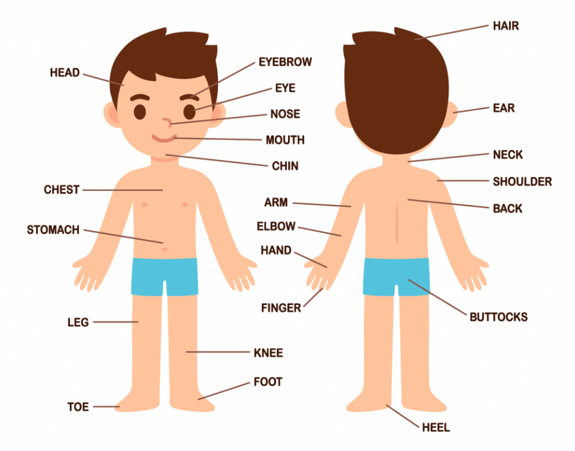
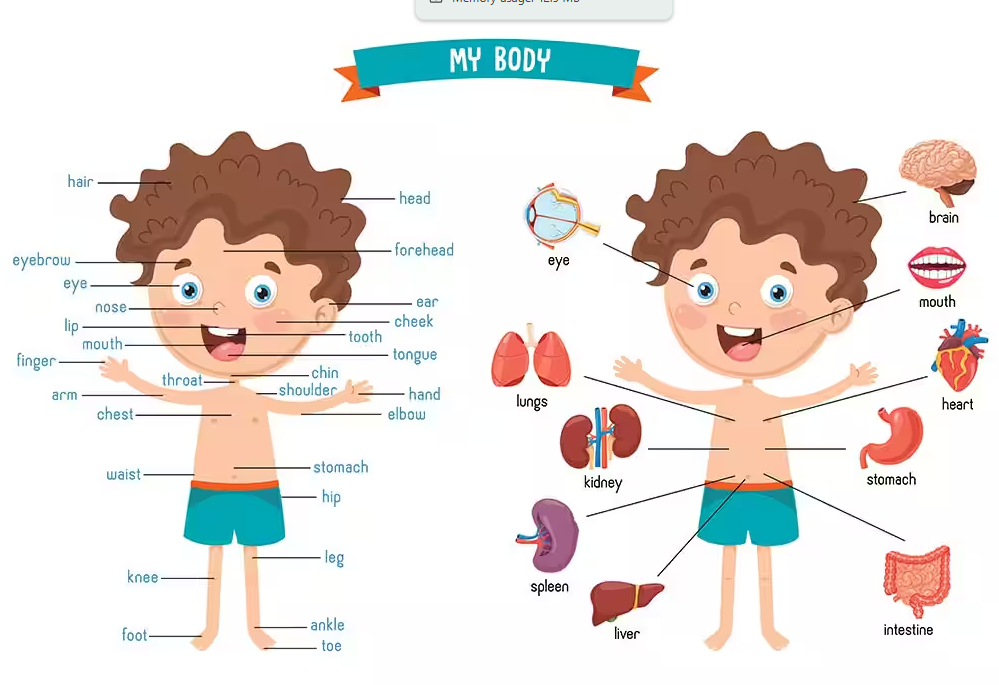

<h1 align="center">English Language Notes</h1>

- [Basic English:](#basic-english)
  - [Alphabet:](#alphabet)
  - [Name of 7 Days:](#name-of-7-days)
  - [Name of 12 Months:](#name-of-12-months)
  - [Numbers:](#numbers)
  - [Animals:](#animals)
  - [Birds:](#birds)
  - [Fish:](#fish)
  - [Insects:](#insects)
  - [Fruits:](#fruits)
  - [Vegetables:](#vegetables)
  - [Human Body:](#human-body)

# Basic English:

## Alphabet:

| Col 1      | Col 2      | Col 3   | Col 4    | Col 5    | Col 6       | Col 7  |
| ---------- | ---------- | ------- | -------- | -------- | ----------- | ------ |
| A = এই     | **B = বী👄** | C = সী   | D = ডী    | E = ঈ    | **F = এফ😁** | G = জী  |
| H = এইচ্    | I = আই     | J = জেই  | K = খেই   | L = এল   | M = এম      | N = এন |
| O = ওউ     | **P = ফী👄** | Q = খীউ  | R = আর/আ | S = এস   | T = ঠী       | U = ইউ |
| **V = ভী😁** | W = ডাবলইউ  | X = এক্স | Y = ওয়াই  | Z = জি/জেড |             |        |

Note: 
- B, P (👄): দুই ঠোঁট মিশিয়ে পড়তে হবে।
- F, V (😁): উপরের দাঁত নিচের ঠোঁটের সাথে মিশিয়ে পড়তে হবে।

Note:
| Rule          | american accent               | british  accent      |
| ------------- | ----------------------------- | -------------------- |
| r after vowel | ALWAYS pronounced (car = kar) | DROPPED (car = kaa)  |
| t in middle   | d-ডী  (water = wa-der)         | t-ঠী (water = wo-tuh) |

- Vowel 5 টি : A, E, I, O, U
- Consonant 21 টি: All letters except A, E, I, O, U

## Name of 7 Days:
- Saturday = স্যাডারডেই/স্যাঠাডেই
- Sunday = সানডেই
- Monday = মানডেই
- Tuesday = চুজডেই
- Wednesday = ওয়েন্সডেই
- Thursday = থ্রাজডেই/থাজডেই
- Friday = ফ্রাইডেই

Note:
| Rule          | american accent               | british  accent      |
| ------------- | ----------------------------- | -------------------- |
| r after vowel | ALWAYS pronounced (car = kar) | DROPPED (car = kaa)  |
| t in middle   | d-ডী  (water = wa-der)         | t-ঠী (water = wo-tuh) |

- Vowel 5 টি : A, E, I, O, U
- Consonant 21 টি: All letters except A, E, I, O, U

For Practice:

|             |                            |                 |                |
| ----------- | -------------------------- | --------------- | -------------- |
| Day = ডেই    | Pay = ফেই                   | Lay = লেই        | May = মেই       |
| Say = ছেই    | Okay = ঔখেই                 | Bay = বেই        | Holiday = হলিডেই |
| Today = ঠুডেই | Yesterday = ইয়েস্টারডেই/ইয়েস্টাডেই | Display = ডিসপ্লেই |                |

## Name of 12 Months:
- January = জ্যানুয়ারী/জানুয়ারী
- February = ফেব্রুয়ারি/ফেবuয়ারি 
- March = মাচ
- April = এইপ্রল
- May = মেই
- June = জুন
- July = জুলাই
- August = ওগাস্ট
- September = সেপঠেম্বার/সেপঠেম্বা
- October = অকঠোবার/অকঠোবা
- November = নৌভেম্বার/নৌভেম্বা
- December = ডিসেম্বার/ডিসেম্বা

Note:
| Rule          | american accent               | british  accent      |
| ------------- | ----------------------------- | -------------------- |
| r after vowel | ALWAYS pronounced (car = kar) | DROPPED (car = kaa)  |
| t in middle   | d-ডী  (water = wa-der)         | t-ঠী (water = wo-tuh) |

- Vowel 5 টি : A, E, I, O, U
- Consonant 21 টি: All letters except A, E, I, O, U

## Numbers:

|     |              |           |
| --- | ------------ | --------- |
| 01  | One          | ওয়ান       |
| 02  | Two          | ঠু         |
| 03  | Three        | থ্রি        |
| 04  | Four         | ফৌর/ফৌ      |
| 05  | Five         | ফাইভ       |
| 06  | Six          | সিক্স       |
| 07  | Seven        | সেভেন       |
| 08  | Eight        | এইঠ       |
| 09  | Nine         | নাইন       |
| 10  | Ten          | ঠেন        |
| 11  | Eleven       | এলাভেন      |
| 12  | Twelve       | ঠুয়ালভ      |
| 13  | Thirteen     | থারঠীন/থাঠীন  |
| 14  | Fourteen     | ফৌরঠীন/ফোঠীন  |
| 15  | Fifteen      | ফিফঠীন      |
| 16  | Sixteen      | সিক্সঠীন     |
| 17  | Seventeen    | সেভেনঠীন     |
| 18  | Eighteen     | এইঠীন      |
| 19  | Nineteen     | নাইনঠীন     |
| 20  | Twenty       | ঠুয়েনি/ঠুয়েনঠি  |
| 21  | Twenty One   | ঠুয়েনি অন    |
| 22  | Twenty Two   | ঠুয়েনি ঠু     |
| 23  | Twenty Three | ঠুয়েনি থ্রি    |
| 24  | Twenty Four  | ঠুয়েনি ফোর    |
| 25  | Twenty Five  | ঠুয়েনি ফাইভ   |
| 26  | Twenty Six   | ঠুয়েনি সিক্স   |
| 27  | Twenty Seven | ঠুয়েনি সেভেন   |
| 28  | Twenty Eight | ঠুয়েনি এইঠ   |
| 29  | Twenty Nine  | ঠুয়েনি নাইন   |
| 30  | Thirty       | থারঠি/থাঠি    |
| 40  | Forty        | ফৌরঠি/ফোঠি    |
| 50  | Fifty        | ফিফঠি       |
| 60  | Sixty        | সিক্সঠি      |
| 70  | Seventy      | সেভেনঠি      |
| 80  | Eighty       | এইঠি       |
| 90  | Ninety       | নাইনঠি      |
| 100 | One Hundred  | ওয়ান হানড্রেড |

|                |      |                 |
| -------------- | ---- | --------------- |
| First          | 1st  | ফার্স্ট            |
| Second         | 2nd  | সেখেন্ড            |
| Third          | 3rd  | থারড/থাড          |
| Fourth         | 4th  | ফৌরথ/ফৌথ          |
| Fifth          | 5th  | ফিফথ             |
| Sixth          | 6th  | সিক্সথ            |
| Seventh        | 7th  | সেভেন্থ            |
| Eighth         | 8th  | এইঠথ            |
| Ninth          | 9th  | নাইন্থ            |
| Tenth          | 10th | টেন্থ             |
| Eleventh       | 11th | এলাভেন্থ           |
| Twelfth        | 12th | ঠুয়ালভথ           |
| Thirteenth     | 13th | থারর্ঠীন্থ/থার্ঠীন্থ    |
| Fourteenth     | 14th | ফৌরঠীন্থ/ফৌঠীন্থ      |
| Fifteenth      | 15th | ফিফঠীন্থ           |
| Sixteenth      | 16th | সিক্সঠীন্থ          |
| Seventeenth    | 17th | সেভেনঠীন্থ          |
| Eighteenth     | 18th | এইঠীন্থ           |
| Nineteenth     | 19th | নাইনঠীন্থ          |
| Twentieth      | 20th | ঠুয়েনঠিথ           |
| Twenty First   | 21st | ঠুয়েনি/ঠুয়েনঠি ফার্স্ট   |
| Twenty Second  | 22nd | ঠুয়েনি/ঠুয়েনঠি সেকেন্ড   |
| Twenty Third   | 23rd | ঠুয়েনি/ঠুয়েনঠি থারড/থাড |
| Twenty Fourth  | 24th | ঠুয়েনি/ঠুয়েনঠি ফৌরথ/ফৌথ |
| Twenty Fifth   | 25th | ঠুয়েনি/ঠুয়েনঠি ফিফথ    |
| Twenty Sixth   | 26th | ঠুয়েনি/ঠুয়েনঠি সিক্সথ   |
| Twenty Seventh | 27th | ঠুয়েনি/ঠুয়েনঠি সেভেন্থ   |
| Twenty Eighth  | 28th | ঠুয়েনি/ঠুয়েনঠি এইথ    |
| Twenty Ninth   | 29th | ঠুয়েনি/ঠুয়েনঠি নাইন্থ   |
| Thirtieth      | 30th | থারঠিথ/থার্ঠিথ       |

Note:
| Rule          | american accent               | british  accent      |
| ------------- | ----------------------------- | -------------------- |
| r after vowel | ALWAYS pronounced (car = kar) | DROPPED (car = kaa)  |
| t in middle   | d-ডী  (water = wa-der)         | t-ঠী (water = wo-tuh) |

- Vowel 5 টি : A, E, I, O, U
- Consonant 21 টি: All letters except A, E, I, O, U

## Animals: 

| Animal     | American Accent | British Accent |
| ---------- | --------------- | -------------- |
| Dog        | daw-g           | dog            |
| Cat        | kat             | kat            |
| Cow        | kow             | kow            |
| Goat       | goht            | gəʊt           |
| Sheep      | sheep           | sheep          |
| Horse      | hors            | haws           |
| Pig        | pig             | pig            |
| Rabbit     | rab-it          | rab-it         |
| Mouse      | mous            | maʊs           |
| Rat        | rat             | rat            |
| Deer       | deer            | deer           |
| Wolf       | wulf            | wulf           |
| Fox        | foks            | foks           |
| Bear       | bair            | beh-uh         |
| Lion       | lie-ən          | lie-uhn        |
| Tiger      | tie-gər         | tie-guh        |
| Elephant   | el-uh-fənt      | el-uh-fənt     |
| Monkey     | mung-kee        | mun-kee        |
| Ape        | ayp             | eyp            |
| Gorilla    | guh-ril-uh      | go-ril-uh      |
| Zebra      | zee-brə         | zeh-brə        |
| Giraffe    | juh-raf         | ji-raf         |
| Kangaroo   | kang-gə-roo     | kang-gə-roo    |
| Panda      | pan-də          | pan-də         |
| Camel      | kam-əl          | kam-əl         |
| Donkey     | dong-kee        | don-kee        |
| Horse      | hors            | haws           |
| Buffalo    | buh-fə-loh      | buh-fə-loh     |
| Ox         | oks             | oks            |
| Squirrel   | skwur-əl        | skwi-rəl       |
| Bat        | bat             | bat            |
| Hedgehog   | hej-hog         | hej-hog        |
| Otter      | ot-er           | ot-uh          |
| Seal       | seel            | seel           |
| Dolphin    | dol-fin         | dol-fin        |
| Whale      | wayl            | wayl           |
| Shark      | shark           | shaak          |
| Crocodile  | krok-uh-dile    | krok-uh-dile   |
| Alligator  | al-uh-gay-ter   | al-uh-gay-tuh  |
| Snake      | snayk           | sneɪk          |
| Lizard     | li-zərd         | liz-əd         |
| Turtle     | tur-tl          | tuh-tl         |
| Tortoise   | tor-təs         | taw-təs        |
| Frog       | frog            | frog           |
| Toad       | tohd            | təʊd           |
| Chimpanzee | chim-pan-zee    | chim-pan-zee   |
| Leopard    | lep-ərd         | lep-əd         |
| Cheetah    | chee-tah        | chee-tah       |
| Hyena      | hy-ee-nə        | hy-ee-nə       |

## Birds: 
| Bird       | American Accent | British Accent |
| ---------- | --------------- | -------------- |
| Chicken    | chik-ən         | chik-in        |
| Duck       | duk             | dʌk            |
| Goose      | goos            | goos           |
| Turkey     | tur-kee         | tuh-kee        |
| Eagle      | ee-gəl          | ee-gl          |
| Owl        | owl             | owl            |
| Crow       | kroh            | کرو (kroh)     |
| Pigeon     | pij-ən          | pij-in         |
| Sparrow    | sper-oh         | spar-oh        |
| Parrot     | pair-ət         | pa-rət         |
| Peacock    | pee-kok         | pee-kok        |
| Swan       | swan            | swon           |
| Flamingo   | fluh-ming-go    | फ्लuh-ming-go   |
| Penguin    | peng-gwin       | peng-gwin      |
| Seagull    | see-gul         | see-gul        |
| Woodpecker | wood-pek-er     | wood-pek-uh    |
| Kingfisher | king-fish-er    | king-fish-uh   |
| Robin      | rob-in          | rob-in         |
| Hawk       | hawk            | hawk           |
| Falcon     | fal-kən         | fal-kən        |
| Vulture    | vul-cher        | vul-chuh       |
| Crane      | krayn           | krayn          |
| Stork      | stork           | stawk          |
| Heron      | her-ən          | her-on         |
| Dove       | duhv            | duhv           |
| Canary     | kuh-nair-ee     | kuh-na-ree     |
| Crow       | kroh            | kroh           |
| Magpie     | mag-pie         | mag-pie        |
| Ostrich    | os-trich        | os-trich       |
| Emu        | ee-myoo         | ee-myoo        |

## Fish: 
| Fish                     | American Accent | British Accent |
| ------------------------ | --------------- | -------------- |
| Salmon                   | sam-ən          | sam-ən         |
| Tuna                     | too-nə          | tyoo-nə        |
| Carp                     | karp            | kaap           |
| Catfish                  | kat-fish        | kat-fish       |
| Goldfish                 | gohld-fish      | gohld-fish     |
| Shark                    | shark           | shaak          |
| Eel                      | eel             | eel            |
| Trout                    | trout           | trout          |
| Cod                      | kod             | kod            |
| Sardine                  | sar-deen        | sar-deen       |
| Anchovy                  | an-cho-vee      | an-cho-vee     |
| Mackerel                 | mak-ər-əl       | mak-rəl        |
| Herring                  | her-ing         | her-ing        |
| Snapper                  | snap-er         | snap-uh        |
| Grouper                  | groo-per        | groo-puh       |
| Tilapia                  | tuh-lah-pee-uh  | tih-lah-pee-uh |
| Bass                     | bas             | bahs           |
| Flounder                 | floun-der       | floun-duh      |
| Halibut                  | hal-uh-bət      | hal-uh-bət     |
| Swordfish                | sord-fish       | sawd-fish      |
| Pufferfish               | puh-fer-fish    | puh-fuh-fish   |
| Clownfish                | klown-fish      | klown-fish     |
| Angelfish                | ayn-jel-fish    | ayn-jel-fish   |
| Betta                    | bet-uh          | bet-uh         |
| Guppy                    | gup-ee          | gup-ee         |
| Koi                      | koy             | koy            |
| Barracuda                | bar-uh-koo-duh  | bar-uh-koo-duh |
| Stingray                 | sting-ray       | sting-ray      |
| Bluefish                 | bloo-fish       | bloo-fish      |
| Whitefish                | white-fish      | white-fish     |
| Hilsa (Ilish)            | il-ish          | il-ish         |
| Rohu (Rui)               | roo             | roo            |
| Catla                    | kat-lah         | kat-lah        |
| Mrigal                   | mrig-al         | mrig-al        |
| Pangas                   | pan-gas         | pan-gas        |
| Koi (Climbing perch)     | koy             | koy            |
| Shing (Stinging catfish) | shing           | shing          |
| Magur (Walking catfish)  | ma-gur          | ma-guh         |
| Pabda                    | pab-da          | pab-da         |
| Chital                   | chit-al         | chit-al        |
| Tengra                   | ten-gra         | ten-gra        |
| Boal                     | bo-al           | bo-al          |
| Chanda                   | chan-da         | chan-da        |

## Insects: 

| Insect      | American Accent | British Accent |
| ----------- | --------------- | -------------- |
| Ant         | ant             | ant            |
| Bee         | bee             | bee            |
| Butterfly   | but-er-fly      | but-uh-fly     |
| Mosquito    | muh-skee-toh    | muh-skee-toh   |
| Fly         | fly             | fly            |
| Housefly    | hous-fly        | hous-fly       |
| Cockroach   | kok-rohch       | kok-rohch      |
| Beetle      | bee-tl          | bee-tl         |
| Ladybug     | lay-dee-bug     | lay-dee-bug    |
| Dragonfly   | drag-ən-fly     | drag-ən-fly    |
| Grasshopper | gras-hop-er     | gras-hop-uh    |
| Cricket     | krik-it         | krik-it        |
| Wasp        | wosp            | wosp           |
| Hornet      | hor-net         | hor-net        |
| Termite     | tur-mite        | tuh-mite       |
| Moth        | moth            | moth           |
| Caterpillar | kat-er-pil-er   | kat-uh-pil-uh  |
| Flea        | flee            | flee           |
| Louse       | lous            | lous           |
| Tick        | tik             | tik            |
| Firefly     | fye-er-fly      | fye-uh-fly     |
| Cicada      | si-kay-duh      | si-kay-duh     |
| Locust      | loh-kust        | loh-kust       |
| Stink bug   | stink-bug       | stink-bug      |
| Aphid       | ay-fid          | ay-fid         |

## Fruits:
| Fruit        | American Accent | British Accent |
| ------------ | --------------- | -------------- |
| Apple        | ap-əl           | ap-əl          |
| Banana       | buh-na-nuh      | buh-na-nuh     |
| Orange       | or-inj          | or-inj         |
| Mango        | man-go          | man-go         |
| Grapes       | grayps          | grayps         |
| Pineapple    | pine-ap-əl      | pine-ap-əl     |
| Papaya       | puh-pie-uh      | puh-pie-uh     |
| Watermelon   | waw-ter-mel-ən  | wo-tuh-mel-ən  |
| Guava        | gwa-vuh         | gwa-vuh        |
| Jackfruit    | jak-fruit       | jak-fruit      |
| Coconut      | koh-kuh-nut     | koh-kuh-nut    |
| Lemon        | lem-ən          | lem-ən         |
| Lime         | lime            | lime           |
| Strawberry   | straw-ber-ee    | straw-bruh-ee  |
| Blueberry    | bloo-ber-ee     | bloo-ber-ee    |
| Cherry       | cher-ee         | cher-ee        |
| Peach        | peech           | peech          |
| Pear         | pair            | peh-uh         |
| Plum         | pluhm           | pluhm          |
| Pomegranate  | pom-uh-gran-it  | pom-uh-gran-it |
| Lychee       | lee-chee        | lee-chee       |
| Dragon fruit | drag-ən fruit   | drag-ən fruit  |
| Kiwi         | kee-wee         | kee-wee        |
| Fig          | fig             | fig            |
| Avocado      | av-uh-kah-doh   | av-uh-kah-doh  |

## Vegetables: 
| Vegetable          | American Accent | British Accent |
| ------------------ | --------------- | -------------- |
| Potato             | puh-tay-toh     | puh-tah-toh    |
| Tomato             | tuh-may-toh     | tuh-mah-toh    |
| Onion              | un-yun          | un-yun         |
| Garlic             | gar-lik         | gar-lik        |
| Carrot             | ka-ruht         | ka-ruht        |
| Cabbage            | kab-ij          | kab-ij         |
| Cauliflower        | kaw-li-flau-er  | kaw-li-flau-uh |
| Spinach            | spi-nich        | spi-nich       |
| Lettuce            | let-iss         | let-iss        |
| Cucumber           | kyoo-kum-ber    | kyoo-kum-ber   |
| Eggplant           | egg-plant       | aub-er-jin     |
| Bell pepper        | bel-pep-er      | bel-pep-uh     |
| Chili              | chil-ee         | chil-ee        |
| Pumpkin            | pump-kin        | pump-kin       |
| Radish             | rad-ish         | rad-ish        |
| Beetroot           | beet-root       | beet-root      |
| Turnip             | tur-nip         | tur-nip        |
| Peas               | peez            | peez           |
| Beans              | beens           | beens          |
| Broccoli           | brok-uh-lee     | brok-uh-lee    |
| Corn               | korn            | kawn           |
| Mushroom           | mush-room       | mush-room      |
| Ginger             | jin-jer         | jin-juh        |
| Okra               | oh-kruh         | oh-kruh        |
| Eggplant (Brinjal) | brin-jəl        | brin-jəl       |

## Human Body: 

| Body Part | American Accent | British Accent |
| --------- | --------------- | -------------- |
| Head      | hed             | hed            |
| Hair      | hair            | heh-uh         |
| Face      | fays            | fays           |
| Eye       | eye             | eye            |
| Ear       | eer             | eer            |
| Nose      | nohz            | nohz           |
| Mouth     | mouth           | mouth          |
| Lip       | lip             | lip            |
| Tooth     | tooth           | tooth          |
| Teeth     | teeth           | teeth          |
| Tongue    | tung            | tung           |
| Neck      | nek             | nek            |
| Shoulder  | shohl-der       | shohl-duh      |
| Arm       | arm             | arm            |
| Elbow     | el-boh          | el-boh         |
| Hand      | hand            | hand           |
| Finger    | fing-gər        | fing-guh       |
| Thumb     | thum            | thum           |
| Chest     | chest           | chest          |
| Stomach   | stuh-muk        | stuh-muk       |
| Back      | bak             | bak            |
| Waist     | wayst           | wayst          |
| Leg       | leg             | leg            |
| Knee      | nee             | nee            |
| Foot      | foot            | foot           |
| Feet      | feet            | feet           |
| Toe       | toh             | toh            |
| Skin      | skin            | skin           |
| Heart     | hart            | haat           |
| Brain     | brayn           | brayn          |
| Blood     | blud            | blud           |
